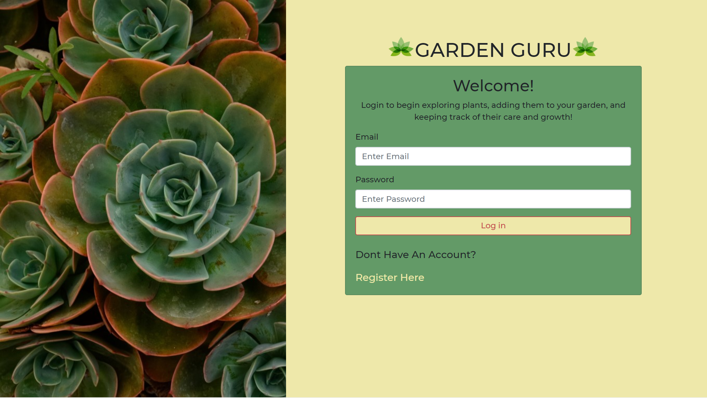
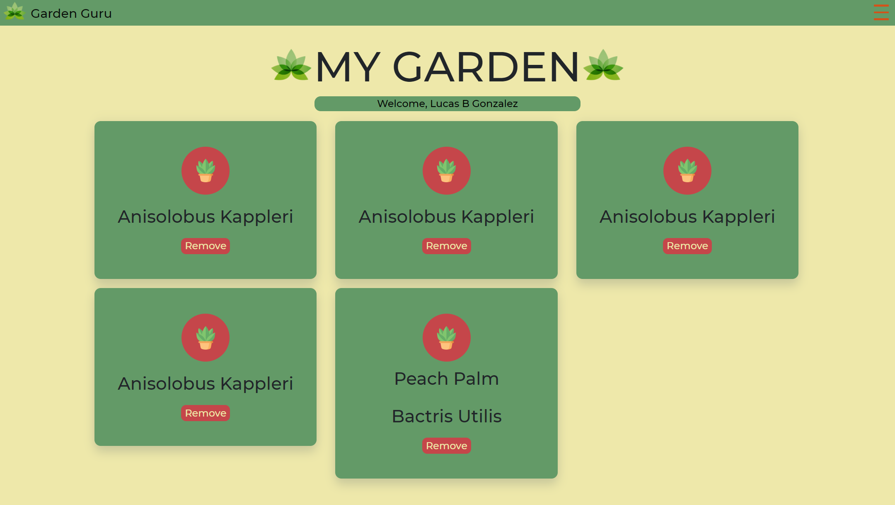
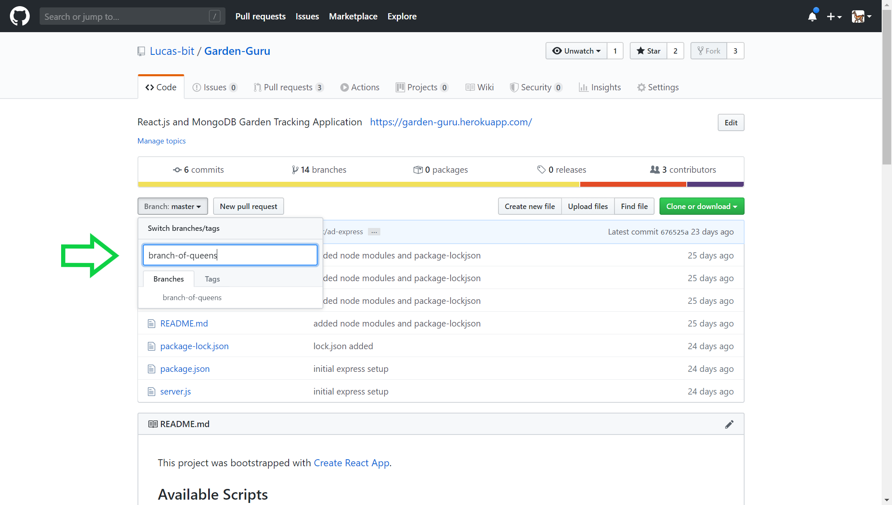
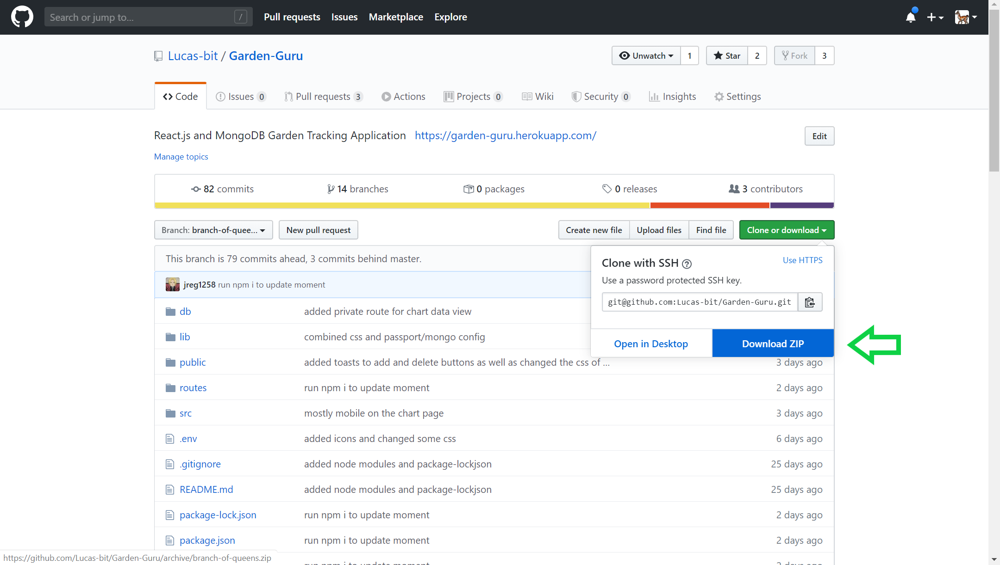
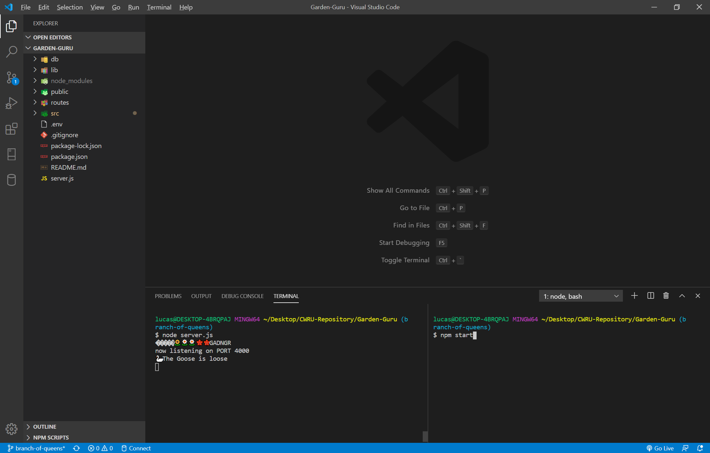

## Garden Guru

 

## About 
A garden tracking mobile-friendly application aimed at helping users keep track of their plants to ensure they are receiving proper care. Users are able to search for their plants, add plants to their garden, remove plants as well as track the overall maintenance of their garden.  

## Getting Started
These instructions will get you a copy of the project up and running on your local machine for development and testing purposes: 
First, switch to the branch named: branch-of-queens

Then, download a copy of the zip file from Github as pictured below.

Unzip the zip file and then open the file in your code editor of choice.

Open up 2 terminals in your code editor

In one terminal run the command: node server.js 

In the other terminal run the command: npm start

This will automatically open up your browser and run the application.

## Built With 

VS Code
React.js, Javascript, HTML5, CSS, Node.js, MongoDB

This project was bootstrapped with [Create React App](https://github.com/facebook/create-react-app).

## Authors/Contributers

Angela dePasquale https://github.com/Angied521

Khalid Muhammad https://github.com/KhalidM53

Joseph Register https://github.com/jreg1258

Lucas Gonzalez lucasberatudgonzalez@gmail.com - https://github.com/Lucas-bit - https://lucas-bit.github.io/Nice-Portfolio/

